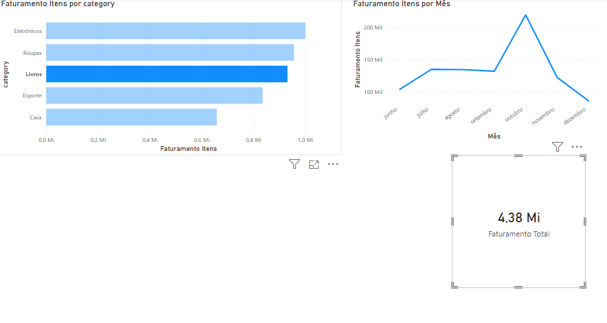

# 🛒 Nexus Retail Analytics

## 📋 Sobre o Projeto
Projeto de Engenharia de Dados simulando um ambiente de varejo real (Nexus Retail).
O objetivo foi construir um pipeline completo: infraestrutura, ingestão, modelagem e visualização.

## 🛠️ Tecnologias
* **Linux (Ubuntu 24.04):** Ambiente de desenvolvimento.
* **Docker:** Containerização do PostgreSQL.
* **Python:** Script de ETL (`populate_db.py`) para gerar dados sintéticos.
* **Power BI:** Dashboard para análise de KPIs.

## 📂 Como executar
1.  Suba o banco de dados com `docker-compose up -d`.
2.  Execute o script `python populate_db.py` para gerar os dados.
3.  Abra o arquivo `nexus_dw.pbix` para explorar o dashboard.
